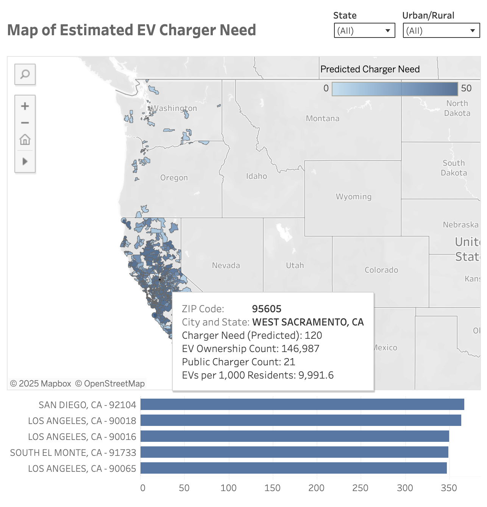

# EV Charger Accessibility Analysis (MSDA Capstone)

This project explores public EV charger availability across ZIP codes in California, Oregon, and Washington to identify areas with insufficient infrastructure. The goal is to support equitable EV charger deployment by using machine learning and public datasets to estimate charger need.

**Results:**  
- **Test R²:** 0.6722 | **RMSE:** 54.50 public chargers  
- Identified **top 5 underserved ZIP codes** across CA/OR/WA based on socioeconomic and EV ownership features  
- Output supports **state DOTs, utilities, and city planners** in prioritizing charging infrastructure investments

## Dashboard

Interactive Tableau dashboard:  
[View Dashboard](https://public.tableau.com/views/Capstone_Project_MSDA_Tableau/EstimatedEVChargerNeedMap?:language=en-US&:sid=&:redirect=auth&:display_count=n&:origin=viz_share_link)

## Final Report

The final paper outlines the background, data sources, methodology, modeling process, results, and policy recommendations.

[`EV_Analysis_Paper.pdf`](https://jtorrescarbajal.github.io/ev-charger-accessibility-analysis/EV_Analysis_Paper.pdf)

## PowerPoint Slides

The presentation summarizes key findings from the project, including data sources, modeling approach, and actionable insights, designed for quick communication with stakeholders.  

[`EV Analysis PowerPoint.pdf`](https://jtorrescarbajal.github.io/ev-charger-accessibility-analysis/EV_Analysis_Powerpoint.pdf)

## Data Sources

All datasets used in this project are **publicly available**. See `data/README.md` for descriptions.

- **EV Station Locations:**  
  [AFDC Alternative Fueling Station Data](https://afdc.energy.gov/data_download)

- **EV Registrations:**  
  - [Washington State EV Data](https://catalog.data.gov/dataset/electric-vehicle-population-data)  
  - [Oregon EV Dashboard](https://www.oregon.gov/energy/Data-and-Reports/Pages/Oregon-Electric-Vehicle-Dashboard.aspx)  
  - [California ZEV Infrastructure Data](https://www.energy.ca.gov/files/zev-and-infrastructure-stats-data)

- **ZIP-Level Demographics:**  
  - [American Community Survey (U.S. Census)](https://data.census.gov)  
  - [RUCA ZIP Code Classifications (USDA)](https://www.ers.usda.gov/data-products/rural-urban-commuting-area-codes/)

## Methodology

- **Target Variable:** Public Charger Count (log-transformed)  
- **Predictors:** Median income, population, EV ownership, renter rate, urban/rural status, and more  
- **Model Used:** Random Forest Regressor (tuned with RandomizedSearchCV)  
- **Evaluation Metrics:** R-sqaured, RMSE, residuals, Wilcoxon test  

## Tools Used

- `Python`: pandas, scikit-learn, matplotlib, seaborn, numpy  
- `Tableau`: for interactive dashboard and visual summaries  
- `Jupyter Notebook`: data cleaning, modeling, and visualizations  

## Repository Structure

ev-charger-analysis  
├── Public Datasets/  
│   └── README.md — Data descriptions & sources  
├── EV_Analysis_Paper.pdf  
├── EV_Analysis.ipynb  
├── README.md  
├── LICENSE

## Data Access

All datasets used in this project are publicly available. Due to file size limitations, they are not stored in this repository. Please refer to [`Public Datasets/README.md`](Public%20Datasets/README.md) for source links and descriptions.

For processed datasets used in the model, download from Google Drive:  
[Download Processed Datasets](https://drive.google.com/drive/folders/1mI4rLcSTy1Z59HO58einBiIiEZLJCsWt?usp=sharing)

## Limitations & Next Steps
- Does not capture transient demand from tourism or pass-through traffic.
- Uses static demographic data; would benefit from time-series EV adoption trends.
- Future iterations: integrate GPS traffic data and clustering to locate high-priority commercial districts.

## License

This project is licensed under the [MIT License](LICENSE).  
All datasets used are publicly available and credited to their respective sources.

## Acknowledgments

Thanks to Western Governors University faculty and reviewers for guidance on this project.  
Special thanks to public data providers like the U.S. Census Bureau, Department of Energy, and state agencies.
